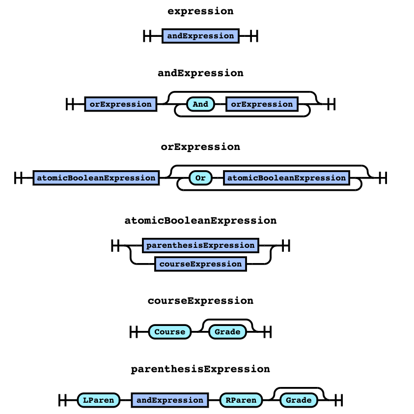

# Admin Console

Deployed endpoint: `https://comet-data-service.web.app/`

Testing endpoint: `https://comet-data-service-4jd5l66fka-uc.a.run.app/`

## Courses

Access and edit information related to courses.

1. `GET /console`:  UI for CRUD console
2. `POST /api/courses`: add a new course
3. `GET /api/courses/search?name=<name>`: get course info by name (public)
4. `GET /api/courses/<id>`: get course info by id (public)
5. `GET /api/courses`: get all courses
6. `PUT /api/courses/<id>`: edit course with id
7. `DELETE /api/courses/<id>`: delete course with id

An example for replacement for `<name>` could be 'CS 3345'.

An example replacement for `<id>` could be '403'.

Note: routes that are not public can only be accessed on the admin console through Google OAuth login. Public routes are available to the public without any authentication.

### Course format:

```javascript
{
    "id": 403,
    "course": "CS 3345",
    "description": "Students will learn about data structures and algorithms",

    // useful info extracted from description
    "hours": "3", 
    "inclass": "3", 
    "outclass": "0",
    "period": "S",

    // prerequisite/corequisite information
    "prerequisites": "(CE 2305 or CS 2305) with a grade of C or better and (CE 2336 or CS 2336 or CS 2337) with a grade of C or better",
    "prerequisiteOrCorequisites": "(CS 3341 or SE 3341 or ENGR 3341)",
    "corequisites": "",

    // miscellaneous information from schedule planner API
    "subjectId": "CS",
    "subjectShort": "CS",
    "subjectLong": "CS - Computer Science",
    "number": "3345",
    "title": "DATA STRUCTURES & ALGORM ANLYS"
    "displayTitle": "3345 - DATA STRUCTURES & ALGORM ANLYS",
    "titleLong": "CS 3345 - DATA STRUCTURES & ALGORM ANLYS",
    "hasRestrictions": false,
    "hasTopics": false,
    "topic": null,
}
```

## Announcements

Stores system-wide announcements that will be displayed in the Comet Planning front-end.

1. `GET /anncmnt`:  UI for CRUD console
2. `POST /announcements`: add a new announcements
3. `GET /announcements/name/<name>`: get announcement info by name (public)
4. `GET /announcements/id/<id>`: get announcement info by id (public)
5. `GET /announcements`: get all announcements
6. `PUT /announcements/<id>`: edit announcement with id
7. `DELETE /announcements/<id>`: delete announcement with id

## Setup

### Environment Variables

This application requires [Firebase config](https://console.firebase.google.com/u/1/project/cometplanning/settings/general/),  [OAuth Client ID](https://console.developers.google.com/apis/credentials?authuser=1&project=cometplanning) (OAuth 2.0 Client IDs section), as well as a [service account for Firebase Admin SDK](https://console.developers.google.com/apis/credentials?authuser=1&project=cometplanning) (Service Accounts section).

Firebase config name mapping:

1. `apiKey`: `firebase_apiKey`
2. `messagingSenderId`: `firebase_messagingSenderId`
3. `appId`: `firebase_appId`

Google OAuth name mapping:

1. `Client ID`: `OAUTH_CLIENT_ID`

Firebase Admin SDK name mapping:

1. `project_id`: `firestore_project_id`
2. `private_key`: `firestore_private_key`
3. `client_email`: `firestore_client_email`

### Google Cloud Run

To deploy the application, there is a bash script `gcr_deploy.sh` that adds the environment variables into the deploy command. Run the script with `./gcr_deploy.sh` and it will automatically deploy using GCR. 

### Firebase Hosting

To deploy to Firebase hosting, run `./firebase_deploy.sh` and it will deploy the GCR container to your Firebase-hosted website.

More details regarding GCR and Firebase Hosting can be found in [the official documentation](https://firebase.google.com/docs/hosting/cloud-run).

## Technical Implementation

### Courses Information

Course data is from College Scheduler, which is UTD's schedule planning tool for students. The API is not publicly accessible and can only be accessed by students who are logged in. Thus, the data was scraped with a JS script and uploaded to Cloud Firestore after extracting information such as prerequisites and hours of work in and out of class.

Unofficial documentation of College Scheduler API: [Github docs](https://github.com/au5ton/docs/wiki/CollegeScheduler-(*.collegescheduler.com))

Containerized "local reverse-proxy" that re-authenticates automatically to persist user session: [Github repository](https://github.com/cougargrades/collegescheduler)

### Degree Plan Information

(Work-In-Progress)

Current plan is to obtain degree plans (in Excel format) from advisors and attempt to create a generalized parser that can continue to parse updated degree plans in later semesters. Another possible approach is to use UTD's degree plan websites for each major, but there is quite a lot of inconsistency both regarding degree structure (especially with regards to tracks) as well as the formatting of the page itself.

### Prerequisite Parsing

[Chevrotain](https://github.com/SAP/chevrotain) is used to parse prerequisite strings. The current parser is not only able to parse a prerequisite string into a tree-like structure, but it can also validate if a prerequisite has been met given a list of courses. This is thanks to the customization that Chevrotain provides in designing the prerequisite language. See below for the current language structure:



One example of Chevrotain's flexibility is the ability to check for course grade minimum. As shown in the picture above, the courseExpression allows a course to contain a flag for a minimum grade, such as "CS 3345 with a grade of C- or higher". The many variations of this type of expression is all contained through regular expression matching. The main parser code is stored in `public/parser.js` and [Chevrotain playground](https://sap.github.io/chevrotain/playground/) was used to generate the image above. 

Also see [NUSMods's implementation](https://github.com/nusmodifications/nusmods/blob/master/scrapers/nus-v2/src/services/requisite-tree/parseString.ts) in TypeScript which is a bit more complex but also uses Chevrotain.